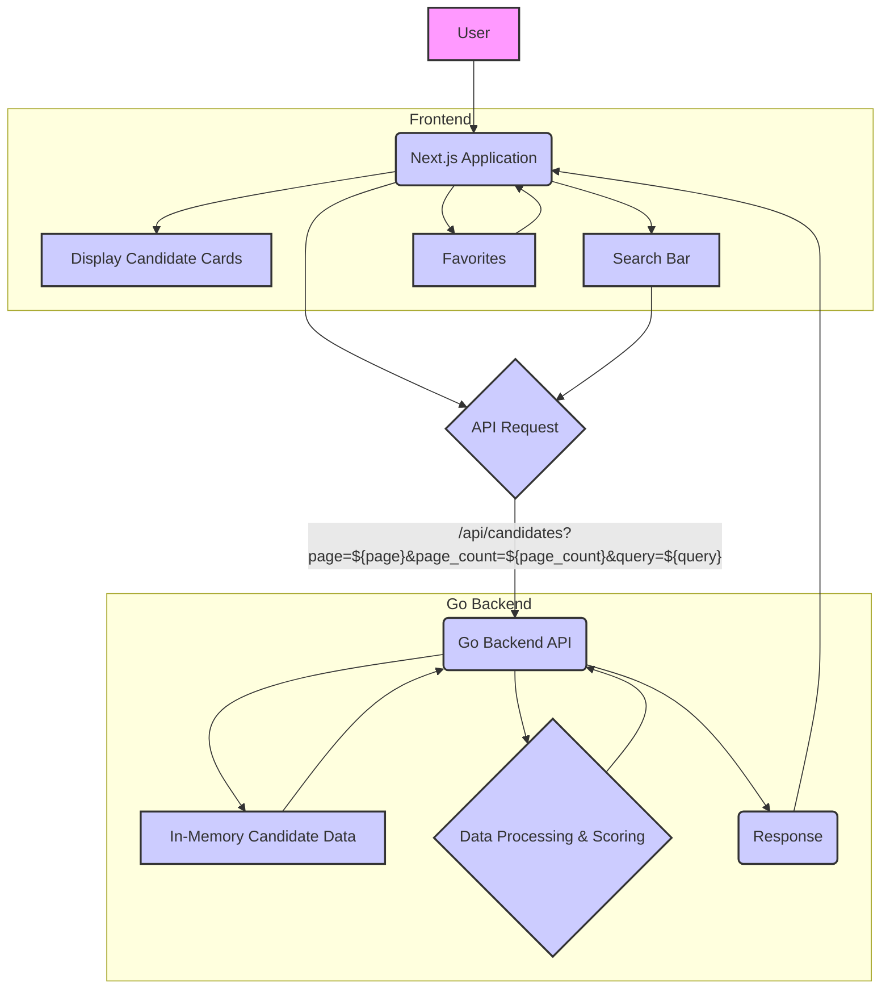

# Hiring top talent 

### Backend 

Tech-stack: Go

- load the `candidates.json` json file
  - As the number of entries are less, we can use in-memory storage for now and database is not needed

Example json entry in json list
```json
  {
    "name": "Loyal Xerus",
    "email": "loyal-xerus@example.com",
    "phone": "17192103718",
    "location": "United States",
    "submitted_at": "2025-01-28 04:43:07.000000",
    "work_availability": [
      "full-time",
      "part-time"
    ],
    "annual_salary_expectation": {
      "full-time": "$76048"
    },
    "work_experiences": [
      {
        "company": "Zwicker & Associates",
        "roleName": "Software Developer"
      }
    ],
    "education": {
      "highest_level": "Bachelor's Degree",
      "degrees": [
        {
          "degree": "Bachelor's Degree",
          "subject": "Computer Science",
          "school": "State Universities",
          "gpa": "GPA 3.0-3.4",
          "startDate": "",
          "endDate": "2023",
          "originalSchool": "University of Massachusetts Lowell",
          "isTop50": true,
          "isTop25": false
        }
      ]
    },
    "skills": [
      "TypeScript",
      "SQL",
      "C#"
    ]
  }
```

- Clean up the data
  - Generate id for each entry to uniquely identify
  - Filter duplicate email and consider the latest one using submitted_at

- Generate score for each candidate ( total score should be for 100 )
  - if `work_availability` list contains `full-time` higher the score
  - if `degrees` list contain a `isTop50: true`, higher the score 
  - if `degrees` list contains a `isTop25: true`, higher the score
  - More the count of relevant `skills`, higher the score with a cap
  - More the count of `work_experience`, higher the score with a cap
  - Lower the `annual_salary_expectation` > `full-time`, higher the score

- API endpoints 
  - GET /api/candidates?page=1&page_count=10&query=''
    - returns all the candidates sorted with score 
    - Paginated list
    - query does full text search


### Frontend 

Tech stack: Typescript, next.js

- Displays the candidate cards in pages
  - Skills should be badges
  - Score with a star
- Search bar for searching candidates 
  - Search makes the API call with query
- Ability to add favorites which displays in another section

### Drawing 


